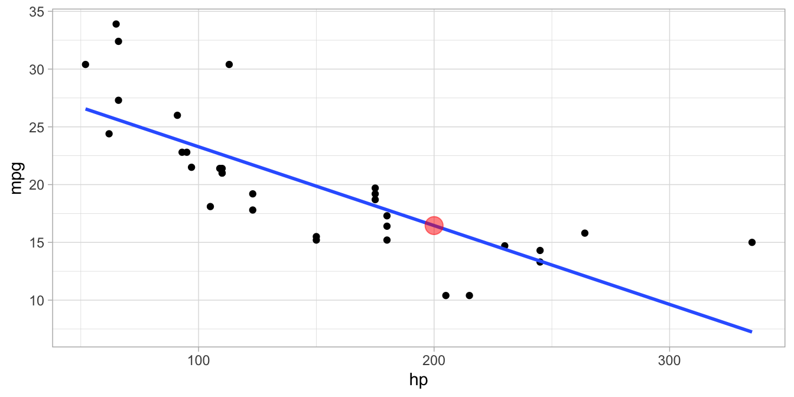
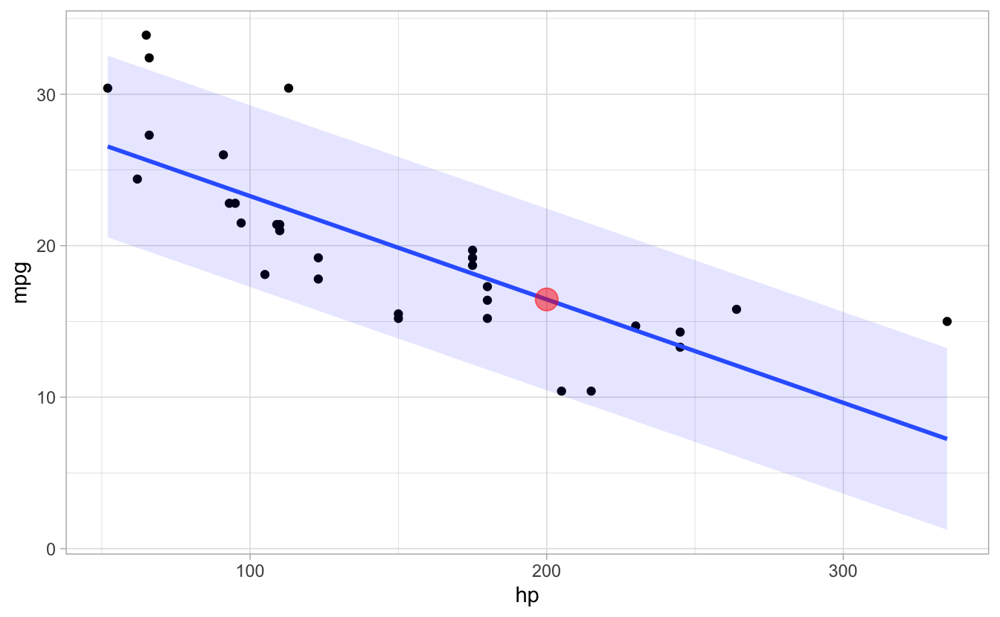
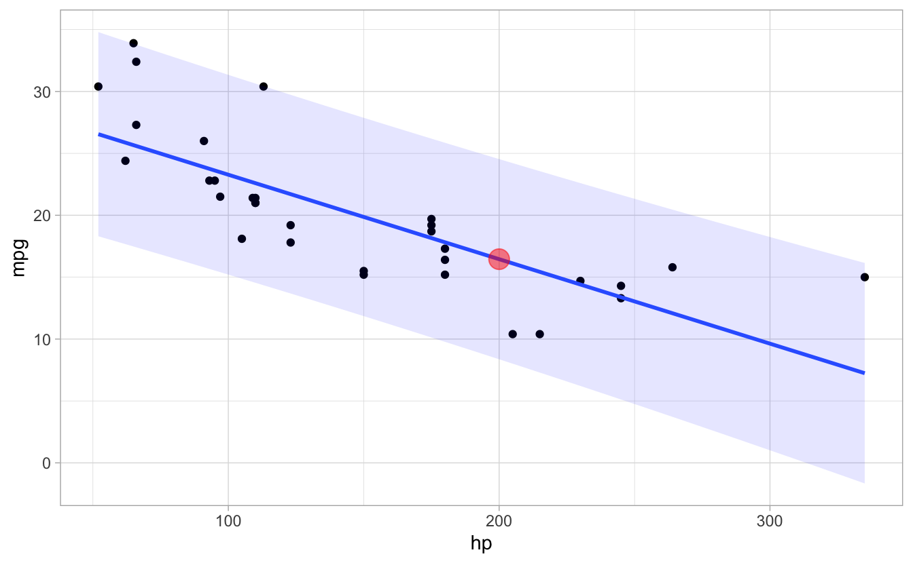

# Inferenz


## Lernsteuerung

### Vorbereitung 

- Lesen Sie die Hinweise zum Modul.
- Installieren (oder Updaten) Sie die für dieses Modul angegeben Software.
- Lesen Sie die angegebene Literatur.


### Lernziele 

- die Definition von Inferenzstatistik sowie Beispiele für inferenzstatistische Fragestellungen nennen
- zentrale Begriffe der Inferenzstatistik nennen und in Grundzügen erklären
- den Nutzen von Inferenzstatistik nennen
- erläutern, in welchem Zusammenhang Ungewissheit zur Inferenzstatistik steht
- Unterschiede zwischen klassischer und Bayes-Inferenz benennen
- Vor- und Nachteile der klassischen vs. Bayes-Inferenz diskutieren
- Die grundlegende Herangehensweise zur Berechnung des p-Werts informell erklären können


### Literatur 

ROS, Kap. 1

### Hinweise 

- Bitte beachten Sie die Hinweise zum Präsenzunterricht und der Streamingoption.
- Bitte stellen Sie sicher, dass Sie einen einsatzbereiten Computer haben und dass die angegebene Software (in aktueller Version) läuft.


## Was ist Inferenz?


### Deskriptiv- vs. Inferenzstatistik


*Deskriptivstastistik* fasst Stichprobenmerkmale zu Kennzahlen (Statistiken) zusammen.

*Inferenzstatistik* schließt von Statistiken auf Parameter (Kennzahlen von Grundgesamtheiten).

🏋 Schließen Sie die Augen und zeichnen Sie obiges Diagramm!


### Wozu ist die Inferenstatistik gut?


:::: {.infobox .quote}
Inferenz bedeutet logisches Schließen; auf Basis von vorliegenden Wissen wird neues Wissen generiert.
:::

:::: {.infobox .quote}
Inferenzstatistik ist ein Verfahren, das mathematische Modelle (oft aus der Stochastik) verwendet, um von einer bestimmten Datenlage, die eine Stichprobe einer Grundgesamtheit darstellt, allgemeine Schlüsse zu ziehen.
:::


🏋️️ Heute Nacht vor dem Schlafen wiederholen Sie die Definition. Üben Sie jetzt schon mal.

<!-- ## Die drei Aufgaben der Inferenzstatistik -->


<!-- 1. Von der Stichprobe auf die Grundgesamtheit schließen  -->

<!-- 2. Von der Experimental- auf die Kontrollgruppe zu schließen -->

<!-- 3. Vom beobachteten Messwert auf das zugrundeliegende Konstrukt zu schließen -->


### Deskriptiv- und Inferenzstatistik gehen Hand in Hand


🏋️ Für jede Statistik (Kennzahl  von Stichprobendaten) kann man die Methoden der Inferenzstatistik verwenden, z.B.:


\begin{table}
\centering
\begin{tabular}{l|l|l}
\hline
Kennwert & Stichprobe & Grundgesamtheit\\
\hline
Mittelwert & $\bar{X}$ & $\mu$\\
\hline
Streuung & $sd$ & $\sigma$\\
\hline
Anteil & $p$ & $\pi$\\
\hline
Korrelation & $r$ & $\rho$\\
\hline
Regression & $b$ & $\beta$\\
\hline
\end{tabular}
\end{table}


Für Statistiken (Stichprobe) verwendet man lateinische Buchstaben; für Parameter (Population) verwendet man griechische Buchstaben.

🏋️ Geben Sie die griechischen Buchstaben für typische Statistiken an!


### Schätzen von Parametern einer Grundgesamtheit


Meist begnügt man sich nicht mit Aussagen für eine Stichprobe, sondern will auf eine Grundgesamtheit verallgemeinern.

Leider sind die Parameter einer Grundgesamtheit zumeist unbekannt, daher muss man sich mit *Schätzungen* begnügen.

Schätzwerte werden mit einem "Dach" über dem Kennwert gekennzeichnet, z.B.


\begin{table}
\centering
\begin{tabular}{l|l|l|l}
\hline
Kennwert & Stichprobe & Grundgesamtheit & Schätzwert\\
\hline
Mittelwert & $\bar{X}$ & $\mu$ & $\hat{\mu}$\\
\hline
Streuung & $sd$ & $\sigma$ & $\hat{\sigma}$\\
\hline
Anteil & $p$ & $\pi$ & $\hat{\pi}$\\
\hline
Korrelation & $r$ & $\rho$ & $\hat{\rho}$\\
\hline
Regression & $b$ & $\beta$ & $\hat{\beta}$\\
\hline
\end{tabular}
\end{table}


### Beispiele für  inferenzstatistische Fragestellungen


Sie testen zwei Varianten Ihres Webshops (V1 und V2), die sich im Farbschema unterscheiden und ansonsten identisch sind: Hat das Farbschema einen Einfluss auf den Umsatz?

- Dazu vergleichen Sie den mittleren Umsatz pro Tag von V1 vs. V2, $\bar{X}_{V1}$ und $\bar{X}_{V2}$.

- Die Mittelwerte unterscheiden sich etwas, $\bar{X}_{V1} > \bar{X}_{V2}$

- Sind diese Unterschiede "zufällig" oder "substanziell"? Gilt also $\mu_{V1} > \mu_{V2}$ oder gilt  $\mu_{V1} \le \mu_{V2}$?

- Wie groß ist die Wahrscheinlichkeit^[oft mit *Pr* oder *p* abgekürzt, für *probability*] $Pr(\mu_{V1} > \mu_{V2})$?


🏋️ *Predictive Maintenance* ist ein Anwendungsfeld inferenzstatistischer Modellierung. Lesen Sie dazu S. 3 [dieses Berichts](https://www.rolandberger.com/publications/publication_pdf/roland_berger_vdma_predictive_maintenance_d_1.pdf)!


## Unsicherheit

### Inferenz beinhaltet Unsicherheit

Inferenzstatistische Schlüsse sind mit Unsicherheit behaftet: 
Schließlich kennt man nur einen Teil (die Stichprobe) eines Ganzen (die Population),
möchte aber vom Teil auf das Ganze schließen.

Zur Bemessung der Unsicherheit bedient man sich der Wahrscheinlichkeitsrechnung (wo immer möglich).


Die Wahrscheinlichkeitstheorie bzw. -rechnung wird auch als die Mathematik des Zufalls bezeichnet.


:::: {.infobox .quote}
Unter einem zufälligen Ereignis (random) verstehen wir ein Ereignis, das nicht (komplett) vorherzusehen ist, wie etwa die Augenzahl Ihres nächsten Würfelwurfs. Zufällig bedeutet nicht (zwangsläufig), dass das Ereignisse keine Ursachen besitzt. So gehorchen die Bewegungen eines Würfels den Gesetzen der Physik, nur sind uns diese oder die genauen Randbedingungen nicht (ausreichend) bekannt.
:::


🏋 Welche physikalischen Randbedingungen wirken wohl auf einen Münzwurf ein?


### Beispiele zur Quantifizierung von Ungewissheit


Aussagen mit Unsicherheit können unterschiedlich präzise formuliert sein.

- Morgen regnet's $\Leftrightarrow$ Morgen wird es hier mehr als 0 mm Niederschlag geben ($p=97\%$).

- Methode $A$ ist besser als Methode $B$ $\Leftrightarrow$ Mit einer Wahrscheinlichkeit von 57% ist der Mittelwert für Methode $A$ höher als für Methode $B$.

- Die Maschine fällt demnächst aus $\Leftrightarrow$ Mit einer Wahrscheinlichkeit von 97% wird die Maschine in den nächsten 1-3 Tagen ausfallen, laut unserem Modell.

- Die Investition lohnt sich $\Leftrightarrow$ Die Investition hat einen Erwartungswert von 42 Euro; mit 90% Wahrscheinlichkeit wird der  Gewinn zwischen -10000 und 100 Euro.


🏋  Geben Sie weitere Beispiele an!


### Visualisierung von Punktschätzungen





Rot markiert: Die Punktschätzung von `mpg` für `hp=200`.

🏋  Geben Sie ein vergleichbares Beispiel an!


### Die Punktschätzung berücksichtigt nicht die Ungewissheit des Models

Zwei Arten von Ungewissheit müssen wir (mindestens) in unseren Vorhersagen berücksichtigen:

1. zur Lage der Regressionsgeraden ($\beta_0$, $\beta_1$)
2. zu Einflüssen, die unser Modell nicht kennt ($\epsilon, \sigma$)


#### Unsicherheit in $\beta_0, \beta1$


#### Unsicherheit durch $\epsilon$ ($\sigma$)




### Vorhersage-Intervall: berücksichtigt Ungewissheit in $\beta_0, \beta_1, \epsilon$

Das Vorhersage-Intervall berücksichtigt Ungewissheit in $\beta_0, \beta_1, \epsilon$ bei der Vorhersage von $\hat{y_i}$.





🏋 Interpretieren Sie den Ungewissheitskorridor!


## Klassische vs. Bayes-Inferenz


### Klassische Inferenz: Frequentismus


- Die Berücksichtigung von Vorwissen zum Sachgegenstand wird vom Frequentismus als subjektiv zurückgewiesen.
- Nur die Daten selber fliesen in die Ergebnisse ein
- Wahrscheinlichkeit wird über relative Häufigkeiten definiert.
- Es ist nicht möglich, die Wahrscheinlichkeit einer Hypothese anzugeben. 
- Stattdessen wird angegeben, wie häufig eine vergleichbare Datenlage zu erwarten ist, wenn die Hypothese gilt und der Versuch sehr häufig wiederholt ist.
- Ein Großteil der Forschung (in den Sozialwissenschaften) verwendet diesen Ansatz.


### Bayesianische Inferenz

- Vorwissen (Priori-Wissen) fließt explizit in die Analyse ein (zusammen mit den Daten).
- *Wenn* das Vorwissen gut ist, wird die Vorhersage genauer, ansonsten ungenauer.
- Die Wahl des Vorwissens muss explizit (kritisierbar) sein.
- In der Bayes-Inferenz sind Wahrscheinlichkeitsaussagen für Hypothesen möglich.
- Die Bayes-Inferenz erfordert mitunter viel Rechenzeit und ist daher erst in den letzten Jahren (für gängige Computer) komfortabel geworden.


### Vergleich von Wahrscheinlichkeitsaussagen


#### Frequentismus

- zentrale Statistik: *p-Wert*

- "Wie wahrscheinlich ist der Wert der Teststatistik (oder noch extremere Werte), vorausgesetzt die Nullhypothese gilt und man wiederholt den Versuch unendlich oft (mit gleichen Bedingungen, aber zufällig verschieden und auf Basis unseres Modells)?"


#### Bayes-Statistik

- zentrale Statistik: *Posteriori-Verteilung*

- "Wie wahrscheinlich ist die Forschungshypothese, jetzt, nachdem wir die Daten kennen, auf Baiss unseres Modells?"


🏋  Recherchieren Sie eine Definition des p-Werts und lesen Sie sie genau.

### Frequentist und Bayesianer


[Quelle](https://xkcd.com/1132/)


### Der p-Wert ist wenig intuitiv

<a href="https://imgflip.com/i/6m29tz"></a><div><a href="https://imgflip.com/memegenerator">from Imgflip Meme Generator</a></div>


### Beispiel zum Nutzen von Apriori-Wissen 1


- Ein Betrunkener behauptet, er könne hellsehen.

- Er wirft eine Münze 10 Mal und sagt jedes Mal korrekt vorher, welche Seite oben landen wird.

- Die Wahrscheinlichkeit dieses Ergebnisses ist sehr gering ($2^{-10}$) unter der Hypothese, dass die Münze fair ist, dass Ergebnis also "zufällig" ist.

- Unser Vorwissen lässt uns allerdings trotzdem an der Hellsichtigkeit des Betrunkenen zweifeln, so dass die meisten von uns  die Hypothese von der Zufälligkeit des Ergebnisses wohl nicht verwerfen.


### Beispiel zum Nutzen von Apriori-Wissen 2


- Eine Studie fand einen "großen Effekt" auf das Einkommen von Babies, eine Stunde pro Woche während zwei Jahren an einem psychosozialen Entwicklungsprogramm teilnahmen (im Vergleich zu einer Kontrollgruppe), $n=127$.

- Nach 20 Jahren war das mittlere Einkommen der Experimentalgruppe um 42% höher (als in der Kontrollgruppe) mit einem Konfidenzintervall von 
[+2%,+98%].

- Allerdings lässt uns unser Vorwissen vermuten, dass so ein Treatment das Einkommen nach 20 Jahren kaum verdoppeln lässt. Wir würden den Effekt lieber in einem konservativeren Intervall schätzen (enger um Null).


<!-- # Wachstum -->

<!-- ## Seerose -->

<!-- - Eine Seerose wächst auf einem Teich. [Schön.](https://www.flickr.com/photos/182338742@N07/49286585198/in/faves-193287163@N02/) -->
<!-- - Tag 1: 1 Seerose. Tag 2: 2 Seerosen. Tag 3: 4 Seerosen, etc. -->
<!-- - Am Tag 100 ist der See komplett mit Seerosen bedeckt. -->

<!-- **An welchem Tag ist der See zu 50% mit Seerosen bedeckt?** -->


<!-- ## Wachstumsschritte der Seerose -->


<!-- $$\text{Menge} = 2^{\text{Tage}}$$ -->

<!-- :::::: {.columns} -->
<!-- ::: {.column width="50%"} -->

<!-- ```{r tab11noeval, results = "hide", eval = TRUE, echo = TRUE} -->
<!-- d <- tibble( -->
<!--   Tag = 0:10, -->
<!--   Menge = 2^Tag)  -->
<!-- ``` -->
<!-- :::  -->
<!-- ::: {.column width="50%"} -->
<!-- ```{r tab11, results = "asis"} -->
<!-- tab11 <- -->
<!--   tibble(Tag = 0:10, -->
<!--          Menge = 2^Tag) %>%  -->
<!--   kable() -->

<!-- print(tab11) -->
<!-- ``` -->
<!-- ::: -->
<!-- :::::: -->


<!-- ## Der Logarithmus gibt die Anzahl der (Wachstums-)Tage -->


<!-- ```{r echo = TRUE, size = "tiny"} -->
<!-- log(d$Menge, base = 2) -->
<!-- ``` -->


<!-- *Logarithmieren* liefert von einer Zahl (hier `Menge`) den Exponenten zu einer Basis (hier `2`) zurück. -->

<!-- Umgekehrt liefert *Potenzieren* zu einer Basis (hier `2`) die `Menge` zurück. -->

<!-- ```{r echo = TRUE, size = "tiny"} -->
<!-- 2^d$Tag -->
<!-- ``` -->


<!-- Wachstumsprozesse sind oft multiplikativ, z.B. eine Seerose, die sich in einem Zeitabschnitt $t$ verdoppelt. -->

<!-- ## Rechenregeln für Potenzen -->


<!-- - $a^n = a \cdot a \cdot a \ldots a$ ($n$ Faktoren, $n \in \mathbb{N}$) -->
<!-- - $a^1 = a$ -->
<!-- - $a^0 = 1$ -->
<!-- - $a^{-n} = \frac{1}{a^n}$ -->
<!-- - $a^{\frac{1}{n}} = \sqrt[n]{a}$ -->
<!-- - $a^n \cdot a^m = a^{n+m}$ -->
<!-- - $\frac{a^n}{a^m} = a^{n-m}$ -->
<!-- - $a^n \cdot a^m = (a\cdot b)^n$ -->
<!-- - $\frac{a^n}{b^n} = \left(\frac{a}{b}\right)^n$ -->
<!-- - $(a^n)^m = a^{(n\cdot m)}$ -->


<!-- ## Logarithmus -->

<!-- Die Zahl $x \in \mathbb{R}$ mit $b^x=a$ heißt Logarithmus von $a$ zur Basis $b$. Sie wird mit $x = log_b(a)$ bezeichnet [@cramer_vorkurs_2015]. Dabei seien $a,b > 0$ mit $b \ne1$. -->


<!-- ```{r echo = TRUE} -->
<!-- log(c(2, 4, 8), base = 2) -->
<!-- log(c(10, 100, 1000), base = 10) -->
<!-- log(c(2.71, 2.71^2)) %>% round() -->
<!-- ``` -->


<!-- Gängige Basen sind 2, 10 und $e$ (Eulersche Zahl: $2.7178...$). -->


<!-- ## Rechenregeln zum Logarithmus -->

<!-- - $\text{log}_b(1)=0$ -->
<!-- - $\text{log}_b(b)=1$ -->
<!-- - $b^{\text{log}_b(a)}=a$ -->
<!-- - $\text{log}_b(b^a)=a$ -->

<!-- - $\text{log}_c(a\cdot b) = \text{log}_c(a) + \text{log}_c(b)$ -->
<!-- - $\text{log}_c(\frac{a}{b}) = \text{log}_c(a) - \text{log}_c(b)$ -->
<!-- - $\text{log}_c(b^a) = a \cdot \text{log}_c(b)$ -->


## Literatur
