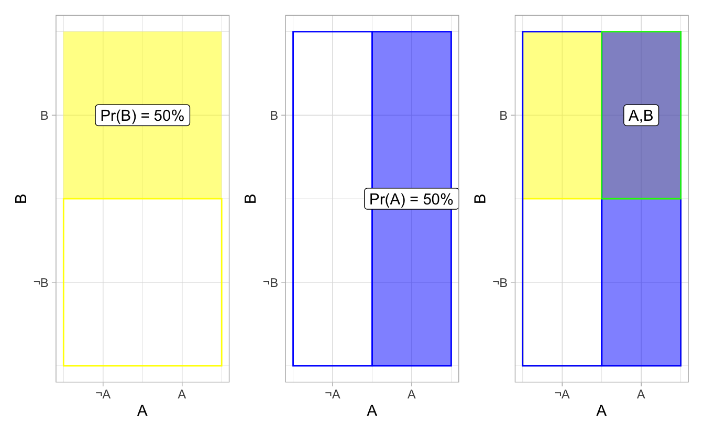
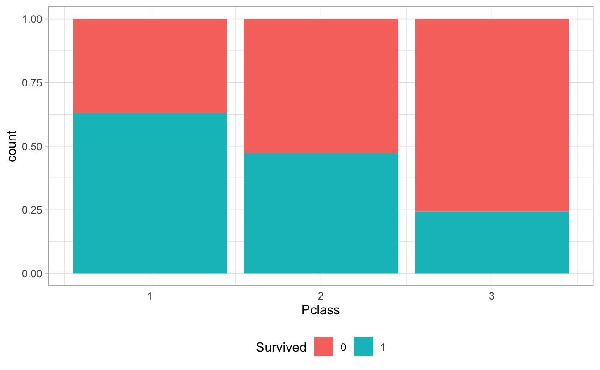
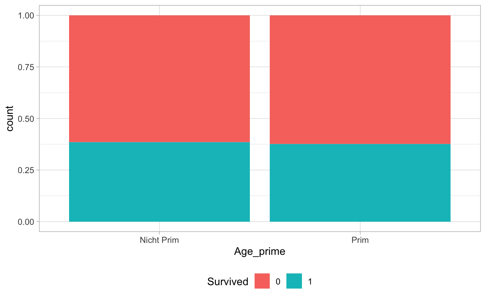
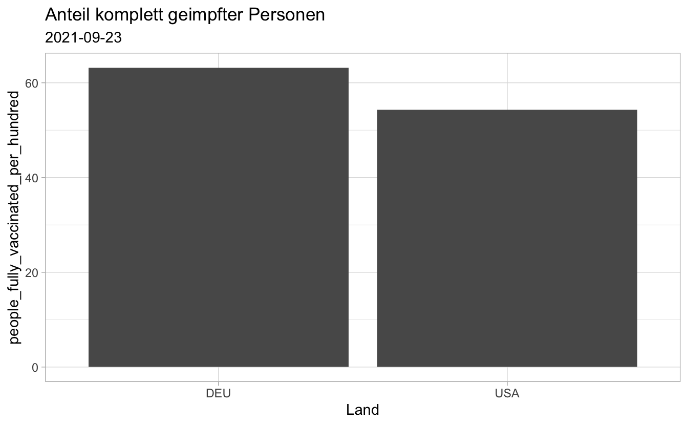
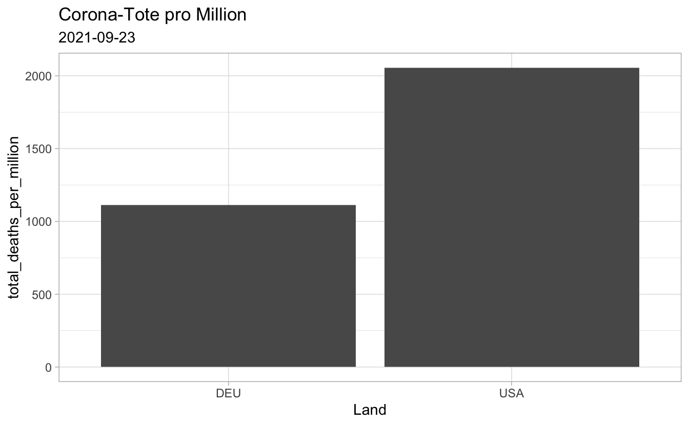

# Ungewissheit quantifizieren

## Lernsteuerung

### Lernziele 

- Wahrscheinlichkeit definieren und relevante Begriffe anführen und in Grundzügen erklären
- einfache Fragen aus der Wahrscheinlichkeitstheorie berechnen

### Literatur 

NA

## Was ist Wahrscheinlichkeit?

Die Wahrscheinlichkeit $p$ quantifiziert *Ungewissheit* im Hinblick auf eine Aussage bzw. ein Ereignis $A$, gegeben eines Hintergrundwissen $H$. $p=0$ heißt, wir halten die Aussage (das Ereignis) für falsch (unmöglich); $p=1$ heißt, wir halten die Aussage (das Ereignis) für wahr (sicher). $0<p<1$ heißt, wir sind (mehr oder weniger) unsicher bzgl. der Aussage bzw. ob das Ereignis zutrifft.

- $p(\text{Kopf werfen mit einer fairen Münze}) = 1/2$.

- $p(\text{eine 6 würfeln mit einer fairen Würfel}) = 1/6$.

- $p(\text{Entweder ist heute Montag oder nicht}) = 1$.

- $p(\text{Berlin ist die Hauptstadt von Frankreich}) = 0$.

🏋 Weitere Beispiele?

## Zufallsexperiment

- Als *Zufallsexperiment* bezeichnen wir einen Vorgang, bei dem wir wissen, was alles passieren könnte, aber nicht sicher sind, was genau passiert.

- Die Menge der möglichen Ergebnisse nennt man *Grundraum* (*Ergebnisraum*) $\Omega$. Beim Würfelwurf: $\Omega = \{1, 2, 3, 4, 5, 6\}$

- Jede Teilmenge $A \subseteq \Omega$ nennt man ein *Ereignis*. Beim Würfelwurf: z.B. $A = \{2, 4, 6\}$, eine gerade Zahl werfen.

- Ein Ereignis, das genau *ein* Element enthält, heißt *Elementarereignis.*

- Ein Ereignis, das alle Elementarereignisse aus $\Omega$ enthält, die nicht zum Ereignis $A$ gehören, nennt man das Komplementärereignis (Komplement) $A^C$ (auch: $\overline{A}, \neg A$). Beim Würfelwurf: Das Komplement von $A=\{2,4,6\}$ ist $A^C=\{1,3,5\}$, die ungeraden Zahlen.

🏋  Beschreiben Sie ein weiteres Zufallsexperiment!

## Additionsregel

Die Wahrscheinlichkeit, dass mindestens eines der beiden sich ausschließenden Ereignissen $A$ und $B$ der Fall ist, ist durch die Additionsregel gegeben:

$Pr(\text{A oder B}) = Pr(A \cup B) = Pr(A) + Pr(B)$

Beispiel: Wahrscheinlichkeit mit einem "fairen" Würfelwurf $X$ eine 1 oder 2 zu werfen:

$Pr(X=1 \cup X=2) = Pr(X=1) + Pr(X=2) = 1/6 + 1/6 = 1/3$

🏋 Was ist $Pr(X < 4)$, $Pr(1 \le X \le 6)$?

## Unabhängigkeit zweier Ereignisse

Zwei Ereignisse sind *(stochastisch) unabhängig*, wenn Kenntnis des einen uns keine Information gibt, ob das andere der Fall ist. Ansonsten nennt man die beiden Ereignisse (stochastisch) *abhängig* oder *zusammenhängend.*

Angenommen wir werfen zwei faire Münzen. Wir wissen, die erste Münze zeigt *Kopf*. Dieses Wissen gibt uns keine weitere Information, welche Seite bei der zweiten Münze oben liegt.

Auf der anderen Seite sind Aktienkurs häufig voneinander abhängig. Weiß man, dass eine Aktie gestiegen ist, so ist es (häufig) wahrscheinlich, dass die andere auch gestiegen ist.

*Achtung:* Stochastische (Un)abhängigkeit impliziert nicht kausale (Un)abhängigkeit.

### Beispiele für abhängige und unabhängige Ereignisse $A$ und $B$

### Unabhängig

- Münzwurf 1 (A) und Münzwurf 2 (B), jeweils fair
- Meine Stimmung (A) und ob das heutige Datum eine Primzahl ist (B)
- Zwei Passanten getrennt zu ihrer Meinung zu einem politischen Thema befragen
- Die Körpergröße zweier zufällig gezogener Personen (A und B) 

### Abhängig

- Körpergröße zweier Geschwister (A und B)
- Lernleistung zwier Schüleris A und B der gleichen Klasse
- PS-Zahl (A) und Spritverbrauch (B)
- Augenzahl beim zweimaligen Wurf (A und B) eines gezinkten Würfels
- Geschlecht (A) und ob die Person Papst ist (B)

## Multiplikationsregel für unabhängige Ereignisse

Seien $A$ und $B$ zwei unabhängige Ereignisse, dann nennt man die *gemeinsame Wahrscheinlichkeit* $Pr(AB)$, die Wahrscheinlichkeit, dass beide Ereignisse eintreten. Sie berechnet sich als Produkt der jeweiligen Wahrscheinlichkeiten von $A$ und $B$:

$$Pr(A \text{ und } B ) = Pr(AB) = Pr(A \cap B) = Pr(A) \cdot Pr(B)$$

Wirft man zwei faire Münzen^[Im Folgenden immer als fair angenommen], so ist die Wahrscheinlichkeit, dass beide Kopf zeigen: $Pr(KK) = Pr(K) \cdot Pr(K) = 1/2 \cdot 1/2 = 1/4$.

🏋 Was ist $Pr(ZZ)$? Ist $Pr(ZK) = Pr(KZ)$?

### Beispiele für die Multiplikationsregel unabhängiger Ereignisse

- Zwei Mal hintereinander eine 6 werfen (fairer Würfel): $Pr(6, 6) = Pr(6) \cdot Pr(6) = 1/6 \cdot 1/6 = 1/36$.

- Beim Lotto wird erst die Zahl $42$ und dann die Zahl $1$ gezogen: $Pr(42,1)=1/49 \cdot 1/48 \approx  4.3\times 10^{-4}$.

- Bei der Klausur alle 10 Richtig-Falsch-Fragen *r*ichtig zu raten: $Pr(10r) = 1/2^{10} \approx  0.001\approx 1/1000$ .

- Wenn man in der Disko 10 Personen anspricht, Korb-Wahrscheinlichkeit $p(K)=9/10$ beträgt, wie hoch ist die Wahrscheinlichkeit    nicht alleine nach hause zugehen? $Pr(\neg0) = 1-0.9^{10} \approx  0.65132$.

- Ei Forschi führt 10 statistische Tests durch, jeweils mit 10% Gefahr, dass ein falsch-positives Ergebnis zustande kommt. Wie hoch ist die Wahrscheinlichkeit für mindestens 1 falsch-positives Ergebnis? $Pr(\neg 0 FP) = 1 - 0.9^{10} \approx 0.65$

### Münzen werfen als Baum: Anzahl *Kopf* nach 2 Würfen

<table>
 <thead>
  <tr>
   <th style="text-align:left;"> Ereignis </th>
   <th style="text-align:left;"> Pr </th>
  </tr>
 </thead>
<tbody>
  <tr>
   <td style="text-align:left;"> 0K </td>
   <td style="text-align:left;"> 1/2 * 1/2 = 1/4 </td>
  </tr>
  <tr>
   <td style="text-align:left;"> 1K </td>
   <td style="text-align:left;"> 1/4 + 1/4 = 1/2 </td>
  </tr>
  <tr>
   <td style="text-align:left;"> 2K </td>
   <td style="text-align:left;"> 1/2 * 1/2 = 1/4 </td>
  </tr>
</tbody>
</table>

🏋 Zeichnen Sie den Baum und berechnen Sie die Wahrscheinlichkeiten für eine gezinkte Münze mit $P(K) = 2/3$.

### Münzen werfen als Baum: Anzahl *Kopf* nach 3 Würfen

<table>
 <thead>
  <tr>
   <th style="text-align:left;"> Ereignis </th>
   <th style="text-align:left;"> Pr </th>
  </tr>
 </thead>
<tbody>
  <tr>
   <td style="text-align:left;"> 0K </td>
   <td style="text-align:left;"> 1/2 * 1/2 * 1/2 = 1/8 </td>
  </tr>
  <tr>
   <td style="text-align:left;"> 1K </td>
   <td style="text-align:left;"> 1/8 + 1/8 + 1/8 = 3/8 </td>
  </tr>
  <tr>
   <td style="text-align:left;"> 2K </td>
   <td style="text-align:left;"> 3 * 1/8 = 3/8 </td>
  </tr>
  <tr>
   <td style="text-align:left;"> 3K </td>
   <td style="text-align:left;"> 1/2 * 1/2 * 1/2 = 1/8 </td>
  </tr>
</tbody>
</table>

## Hintergrundwissen

### Wahrscheinlichkeit ist abhängig vom Hintergrundwissen ($H$)

 $Pr(A|H)$: Die Wahrscheinlichkeit von $A$, *gegeben* $H$. 
 
 - A: "Sokrates ist sterblich."; H: "Alle Menschen sind sterblich und Sokrates ist ein Mensch." $\implies Pr(A|H) = 1$.

- A: "Die Münze zeigt Kopf"; H: "Wir haben keinen Grund anzunehmen, dass eine der beiden Seiten häufiger oben liegt oder das sonst etwas passiert." $\implies Pr(A|H)=1/2$.

- A: "Schorsch, das rosa Einhort, mag Bier."; H: "50% der rosa Einhörner mögen Bier." $\implies Pr(A|H) = 1/2$.

- Die Wahrscheinlichkeit eine 6 zu würfeln (A), gegeben dem Hintergrundwissen (H), dass der Würfel "fair" ist, d.h. wir kein Wissen haben, dass eine Augenzahl häufiger auftritt, ist $1/6$.

### Hintergrundwissen ist subjektiv

Ich habe gerade einen Stift in meiner Hosentasche (links oder rechts). Wie groß ist die Wahrscheinlichkeit, dass der Stift in meiner linken Tasche ist (und nicht in der rechten)?

Bezogen auf *Ihr* Hintergrundwissen gilt: $Pr(\text{A="Stift links"|H="kein besonderes Wissen zu der Frage"}) = 1/2$.

Bezogen auf *mein* Hintergrundwissen gilt: $Pr(\text{A="Stift links"|H="Der Stift ist links"}) = 1$.

@briggs_uncertainty_2016

🏋 Geben Sie ein weiteres Beispiel für die Subjektivität von Hintergrundwissen an! Formalisieren Sie es wie oben gezeigt.

## Bedingte Wahrscheinlichkeit

Wie groß ist die Wahrscheinlichkeit:

- die Klausur zu bestehen, *wenn* man gelernt hat?
- von schlechter Laune, *gegeben* es ist Montag?
- schwer an Corona zu erkranken, *unter der Bedingung*, man ist geimpft? 

$Pr(A|H)$ ist die Wahrscheinlichkeit, dass $A$ eintritt, *gegeben* bzw. *unter der Bedingung*, dass $H$ eingetreten ist.

Formel der bedingten Wahrscheinlichkeit:

$$Pr(B|l) = \frac{Pr(B \cap l)}{Pr(l)}$$

### Kontingenztabelle zur Berechnung von Wahrscheinlichkeiten

Beispiel aus den Klausurergebnissen bei Prof. Süß:

<table>
 <thead>
  <tr>
   <th style="text-align:left;"> . </th>
   <th style="text-align:right;"> bestanden (B) </th>
   <th style="text-align:right;"> nicht (¬B) </th>
   <th style="text-align:right;"> SUMME </th>
  </tr>
 </thead>
<tbody>
  <tr>
   <td style="text-align:left;"> hat gelernt (l) </td>
   <td style="text-align:right;"> 36 </td>
   <td style="text-align:right;"> 6 </td>
   <td style="text-align:right;"> 42 </td>
  </tr>
  <tr>
   <td style="text-align:left;"> nicht (¬l) </td>
   <td style="text-align:right;"> 12 </td>
   <td style="text-align:right;"> 24 </td>
   <td style="text-align:right;"> 36 </td>
  </tr>
  <tr>
   <td style="text-align:left;"> SUMME </td>
   <td style="text-align:right;"> 48 </td>
   <td style="text-align:right;"> 30 </td>
   <td style="text-align:right;"> 78 </td>
  </tr>
</tbody>
</table>

Randwahrscheinlichkeit: $Pr(B) = 48/78 \approx 0.61 \quad Pr(l) = 42/78 \approx 0.54$

Bedingte Wahrscheinlichkeit: $Pr(B|l) = 36/42 \approx \frac{0.46}{0.54} \approx 0.86 \quad Pr(l|B) = 36/48 = 0.75$

Gemeinsame Wahrscheinlichkeit: $Pr(B \cap l) = Pr(l \cap B) = Pr(Bl) = Pr(lB) = 36/78 \approx 0.46$

### Visualierung von gemeinsamer und bedingter Wahrscheinlichkeit

$Pr(AB) = Pr(A) \cdot Pr(B) = 50\% \cdot 50\% = 25\%$

$Pr(A|B) = Pr(A,B) / Pr(B) = 25\% / 50\% = 50\%$

### Visualierung von (un)abhängigen Ereignissen

Ändert sich die Wahrscheinlichkeit eines Ereignisses, wenn man es auf ein anderes bedingt, so sind beide Ereignisse abhängig, ansonsten unabhängig.

#### Abhängig

$P(A|B) \ne Pr(A) \ne Pr(A|\neg B)$

Überleben auf der Titanic ist abhängig von der Passagierklasse.

#### Unabhängig
$P(A|B) = Pr(A) = Pr(A|\neg B)$

Überleben auf der Titanic ist *un*abhängig vom Ereignis *Alter ist eine Primzahl*.

### Beispiel zur Visualisierung zweier abhängiger Ereignisse

Sind die Ereignisse *Tod durch Covid*  bzw. *Impfquote* ($A$) und *Land*^[hier mit den zwei Ausprägungen *DEU* und *USA*] ($B$) voneinander abhängig?

Ja, da in beiden Diagrammen gilt: $P(A|B) \ne Pr(A) \ne Pr(A|\neg B)$.

Daten von [Our World in Data](https://ourworldindata.org/covid-deaths)

@owidcoronavirus

