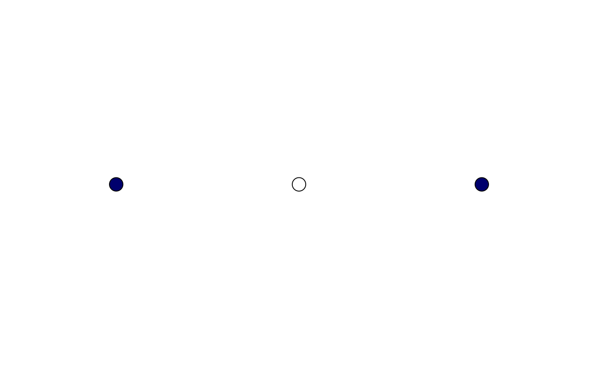
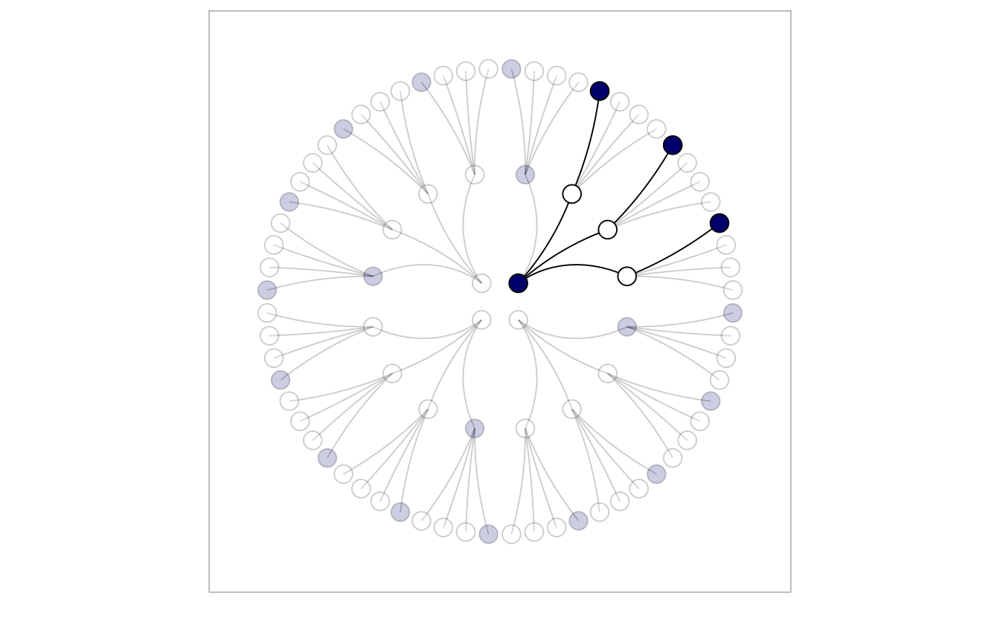
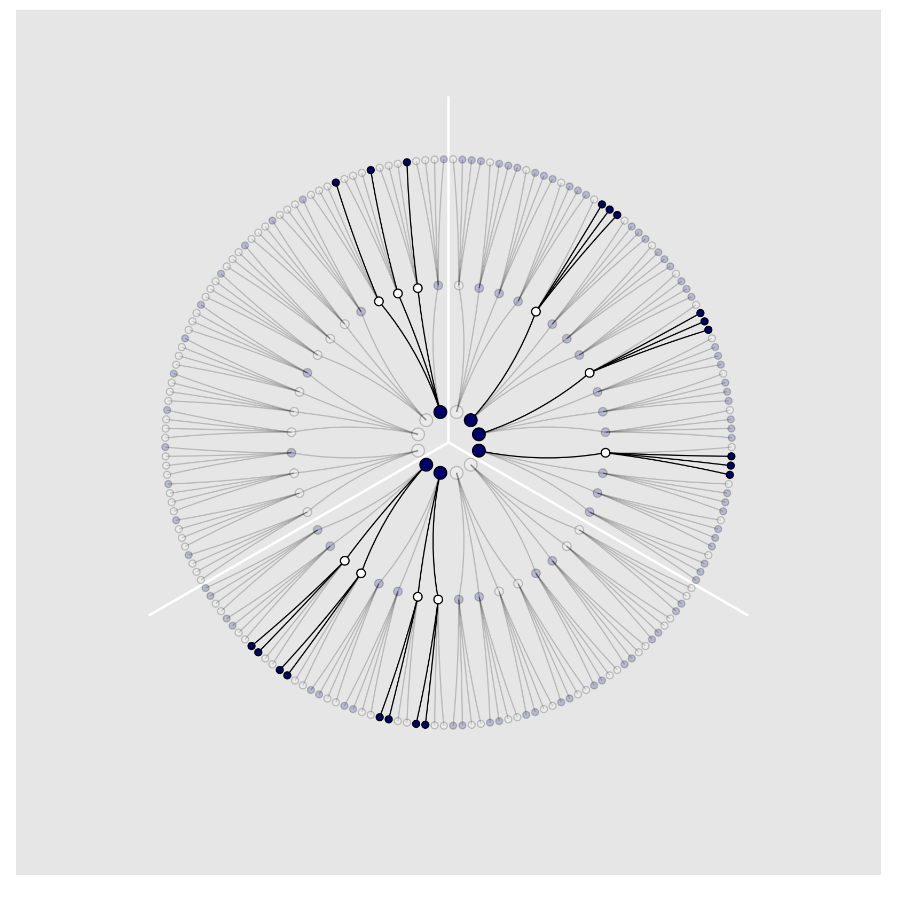
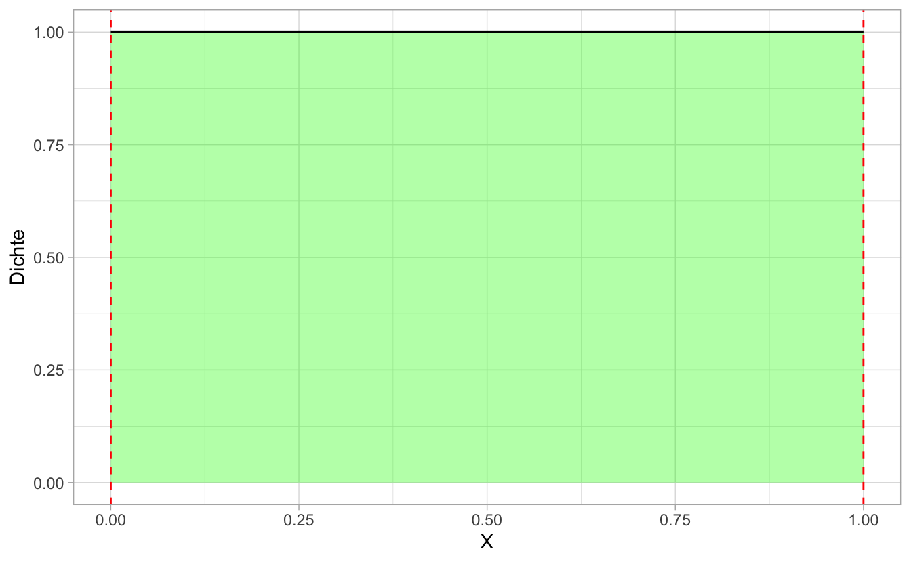
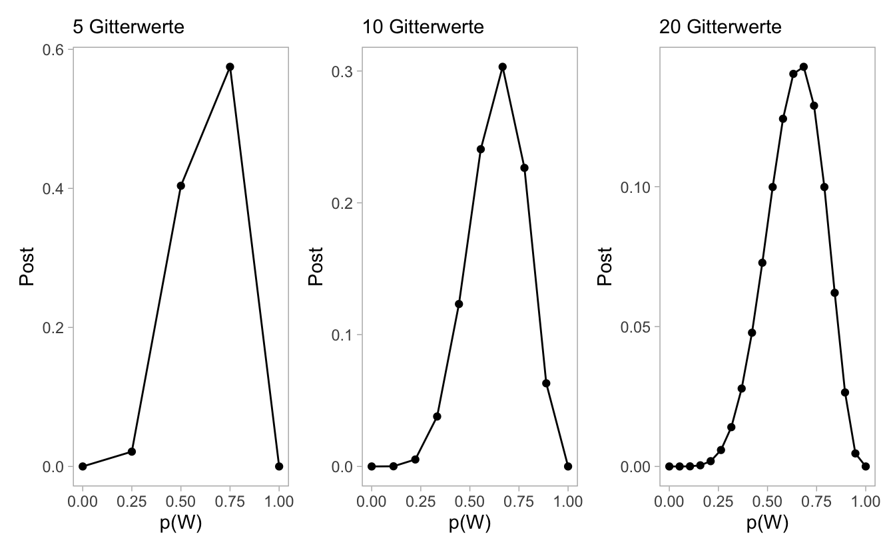
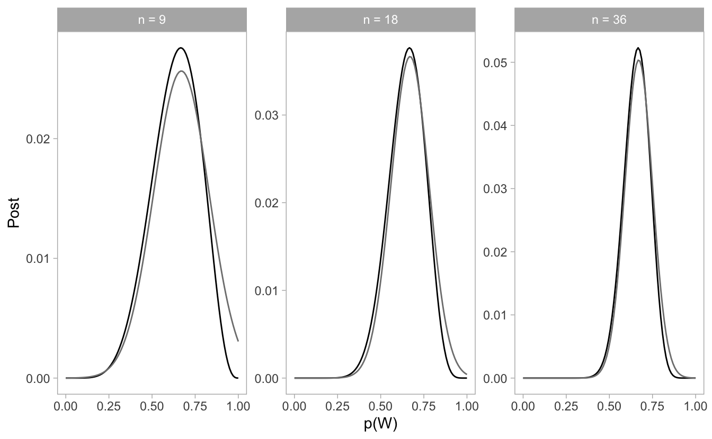

# Bayes


## Lernsteuerung


### Lernziele 

- Wahrscheinlichkeit definieren und relevante Begriffe anführen und in Grundzügen erklären
- einfache Fragen aus der Wahrscheinlichkeitstheorie berechnen


### Literatur 

NA


## Kleine Welt, große Welt


### Behaims Globus, Kolumbus glücklicher Fehler


[Quelle](https://de.wikipedia.org/wiki/Martin_Behaims_Erdapfel#/media/Datei:RavensteinBehaim.jpg)


### Kleine Welt vs. große Welt


#### Kleine Welt 
- Die Welt, wie sie der Golem sieht
- entspricht dem Modell (zwangläufig)


#### Große Welt
- Die Welt, wie sie in Wirklichkeit ist
- entspricht nicht (zwangsläufig) dem Modell


:::: {.infobox .quote}
Behaims Globus ist nicht gleich der Erde. Die kleine Welt ist nicht die große Welt.
:::

Was in der kleinen Welt funktioniert, muss nicht in der großen Welt funktionieren.
 Modelle zeigen immer nur die kleine Welt: Vorsicht vor schnellen Schlüssen und vermeintlicher Gewissheit.

🏋 Nennen Sie ein Beispiel, in dem ein Modell nicht (exakt) der Wirklichkeit entspricht!

### So denkt unser Bayes-Golem


🏋 Bayes-Inferenz ähnelt dem Lernen von Menschen. Geben Sie ein Beispiel von Lernen bei Menschen, das oben dargestelltem Prozess ähnelt!

## Bayes-Statistik als Zählen


### Murmeln im Säckchen

- Sie haben ein Säckchen mit vier Murmeln darin. 

- Sie wissen nicht, welche Farben die Murmeln haben.

- Murmeln gibt's in zwei Farben: weiß (W) oder blau (B).

- Es gibt daher fünf *Hypothesen* zur Farbe der Murmeln im Säckchen: [WWWW], [BWWW], [BBWW], [BBBW], [BBBB.]

- Unser Ziel ist, die Wahrscheinlichkeiten der Hypothesen nach Ziehen von Murmeln zu bestimmen.


### Unsere Daten


- Wir ziehen eine Murmel, merken uns die Farbe und legen sie zurück. Das wiederholen wir noch zwei Mal (Ziehen mit Zurücklegen). 

- Wir erhalten: **BWB**. Voilà: unsere Daten.




[@kurz_statistical_2021]


🏋 Wie groß ist die Stichprobe ($N$)? Ist die Wahrscheinlichkeit für *B* in jedem Zug gleich?


### Zugmöglichkeiten laut Hypothese [BWWW], 1. Zug

Wenn Hypothese [BWWW] der Fall sein sollte, dann können wir im *ersten* Zug entweder die eine blaue Murmel erwischen oder eine der drei weißen.


Nachdem wir die Murmel gezogen haben (und die Farbe gemerkt haben), legen wir sie wieder ins Säckchen: Ziehen mit Zurücklegen.


🏋 Wie viele Elementarereignisse hat dieses Zufallsexperiment? Sind alle gleich wahrscheinlich?


### Zugmöglichkeiten laut Hypothese [BWWW], 1. und 2. Zug

Wenn Hypothese [BWWW] der Fall sein sollte, dann haben wir im *zweiten* Zug natürlich die gleichen Möglichkeiten wie im ersten.

Zug 1 und Zug 2 zusammen genommen gibt es $16=4\cdot4=4^2$ Kombinationen an gezogenen Murmeln:


🏋 Ist jedes Elementarereignis (z.B. BB, BW,...) gleich wahrscheinlich?


### Zugmöglichkeiten laut Hypothese [BWWW], 1.-3. Zug


Zug 1, Zug 2 und Zug 3 zusammen genommen, gibt es dann $4\cdot4\cdot4=4^3=64$ Kombinationen, drei Murmeln zu ziehen.


🏋 Wie wahrscheinlich ist ein bestimmtes dieser 64 Ereignisse (unter der Annahme gleicher Wahrscheinlichkeit)?

### Welche Züge sind logisch möglich?


- Einige Kombinationen ("Pfade") der Hypothese [BWWW] lassen sich nicht mit unseren Daten (BWB) vereinbaren.
- Z.B. alle Kombinationen die mit W beginnen, sind nicht mit unseren Daten zu vereinbaren.



Nur 3 der 64 "Pfade" (Kombinationen), die Hypothese [BWWW] vorgibt, sind mit unseren Daten logisch zu vereinbaren.

### Kombinationen für Hypothesen 

<table>
 <thead>
  <tr>
   <th style="text-align:left;"> Hypothese </th>
   <th style="text-align:left;"> Häufigkeit BWB </th>
  </tr>
 </thead>
<tbody>
  <tr>
   <td style="text-align:left;"> [W W W W] </td>
   <td style="text-align:left;"> 0 * 4 * 0 = 0 </td>
  </tr>
  <tr>
   <td style="text-align:left;"> [B W W W] </td>
   <td style="text-align:left;"> 1 * 3 * 1 = 3 </td>
  </tr>
  <tr>
   <td style="text-align:left;"> [B B W W] </td>
   <td style="text-align:left;"> 2 * 2 * 2 = 8 </td>
  </tr>
  <tr>
   <td style="text-align:left;"> [B B B W] </td>
   <td style="text-align:left;"> 3 * 1 * 3 = 9 </td>
  </tr>
  <tr>
   <td style="text-align:left;"> [B B B B] </td>
   <td style="text-align:left;"> 4 * 0 * 4 = 0 </td>
  </tr>
</tbody>
</table>

- Die Häufigkeiten der Kombinationen (Pfade) ist proportional zur Plausibilität einer Hypothese: Je mehr Pfade laut Hypothese, desto wahrscheinlicher die Hypothese (unter sonst gleichen Bedingungen).

- Zusätzlich müssten wir noch beachten, ob bestimmte Hypothesen *per se* bzw. *a priori* wahrscheinlicher sind. So könnten blaue Murmeln selten sein. Gehen wir der Einfachheit halber zunächst davon aus, dass alle Hypothesen apriori gleich wahrscheinlich sind.


### Pfadbaum für die Hypothesen [BWWW], [BBWW], [BBBW]




### Wir ziehen einer vierte Murmel: B

- Gehen wir zunächst davon aus, dass alle Hypothesen apriori gleich wahrscheinlich sind.
- Wir ziehen  wieder eine Murmel. Sie ist blau (B)!
- Jetzt könnten wir den Pfadbaum für vier (statt drei) Züge aufmalen.
- Oder wir machen ein *Update*: Wir aktualisieren die bisherigen Kombinationshäufigkeiten um die neuen Daten. Die *alten* Daten dienen dabei als *Priori-Informationen* für die *neuen* Daten.

### Priori-Information nutzen

Mit den Daten BWBB ist die Hypothese [BBBW] am wahrscheinlichsten:

<table>
 <thead>
  <tr>
   <th style="text-align:left;"> Hyp </th>
   <th style="text-align:right;"> PB </th>
   <th style="text-align:right;"> HA </th>
   <th style="text-align:left;"> HN </th>
  </tr>
 </thead>
<tbody>
  <tr>
   <td style="text-align:left;"> [W W W W] </td>
   <td style="text-align:right;"> 0 </td>
   <td style="text-align:right;"> 0 </td>
   <td style="text-align:left;"> 0 * 0 = 0 </td>
  </tr>
  <tr>
   <td style="text-align:left;"> [B W W W] </td>
   <td style="text-align:right;"> 1 </td>
   <td style="text-align:right;"> 3 </td>
   <td style="text-align:left;"> 1 * 3 = 3 </td>
  </tr>
  <tr>
   <td style="text-align:left;"> [B B W W] </td>
   <td style="text-align:right;"> 2 </td>
   <td style="text-align:right;"> 8 </td>
   <td style="text-align:left;"> 2 * 8 = 16 </td>
  </tr>
  <tr>
   <td style="text-align:left;"> [B B B W] </td>
   <td style="text-align:right;"> 3 </td>
   <td style="text-align:right;"> 9 </td>
   <td style="text-align:left;"> 3 * 9 = 27 </td>
  </tr>
  <tr>
   <td style="text-align:left;"> [B B B B] </td>
   <td style="text-align:right;"> 4 </td>
   <td style="text-align:right;"> 0 </td>
   <td style="text-align:left;"> 4 * 0 = 0 </td>
  </tr>
</tbody>
</table>

Hyp: Hypothese

PB: Anzahl von Pfaden für B

HA: alte (bisherige) Häufigkeiten

HN: neue (geupdatete) Häufigkeiten


### Murmelfabrik streikt: Blaue Murmeln jetzt sehr selten!

- Berücksichtigen wir jetzt die Information, dass apriori (bevor wir die Daten gesehen haben), einige Hypothesen wahrscheinlicher (plausibler) sind als andere.

- Hier ist die Hypothese [BBWW] am wahrscheinlichsten:

<table>
 <thead>
  <tr>
   <th style="text-align:left;"> Hyp </th>
   <th style="text-align:right;"> HA </th>
   <th style="text-align:right;"> HF </th>
   <th style="text-align:left;"> HN </th>
  </tr>
 </thead>
<tbody>
  <tr>
   <td style="text-align:left;"> [W W W W] </td>
   <td style="text-align:right;"> 0 </td>
   <td style="text-align:right;"> 0 </td>
   <td style="text-align:left;"> 0 * 0 = 0 </td>
  </tr>
  <tr>
   <td style="text-align:left;"> [B W W W] </td>
   <td style="text-align:right;"> 3 </td>
   <td style="text-align:right;"> 3 </td>
   <td style="text-align:left;"> 3 * 3 = 9 </td>
  </tr>
  <tr>
   <td style="text-align:left;"> [B B W W] </td>
   <td style="text-align:right;"> 16 </td>
   <td style="text-align:right;"> 2 </td>
   <td style="text-align:left;"> 16 * 2 = 32 </td>
  </tr>
  <tr>
   <td style="text-align:left;"> [B B B W] </td>
   <td style="text-align:right;"> 27 </td>
   <td style="text-align:right;"> 1 </td>
   <td style="text-align:left;"> 27 * 1 = 27 </td>
  </tr>
  <tr>
   <td style="text-align:left;"> [B B B B] </td>
   <td style="text-align:right;"> 0 </td>
   <td style="text-align:right;"> 0 </td>
   <td style="text-align:left;"> 0 * 0 = 0 </td>
  </tr>
</tbody>
</table>

HF: Häufigkeit des Säckchentyps laut Fabrik.


### Zählen mit großen Zahlen nervt

- Malen Sie mal den Pfadbaum für 10 Züge ...

- Eine Umrechnung der Häufigkeiten in *Anteile* macht das Rechnen einfacher.

- Dazu definieren wir die *geupdatete Plausibilität einer Hypothese nach Kenntnis der Daten*:

$$\text{Plausibilität von [BWWW] nach Kenntnis von BWB}$$
$$\propto$$
$$\text{Anzahl möglicher Pfade bei [BWWW] für BWB}$$
$$\times$$
$$\text{Priori-Plausibilität von [BWWW]}$$

- $\propto$: proportional zu


### Plausibilität berechnen

- Sei $p$ der Anteil blauer Murmeln. Bei Hypothese [BWWW] gilt, dann ist $p=1/4 = 0.25$. Sei $D_{neu} =$ BWB, die Daten:


$$\text{Plausibilität von }p\text{ nach Kenntnis von }D_{neu}$$
$$\propto$$
$$\text{Anzahl Pfade von }p\text{ für }D_{neu}$$
$$\times$$
$$\text{Priori-Plausibilität von }p$$

Für jeden Wert von $p$ beurteilen wir dessen Plausibilität als umso höher, je mehr Pfade durch den Pfadbaum führen und je höher die Plausibilität des Werts von $p$ von vornherein ist.


### Von Plausibilität zur Wahrscheinlichkeit

- Teilen wir die Anzahl Pfade einer Hypothese durch die Anzahl aller Pfade (aller Hypothesen), so bekommen wir einen Anteil. Damit haben wir eine Wahrscheinlichkeit:


$$\text{Pl von }p\text{ mit Daten }D_{neu} =$$
$$\frac{\text{Anzahl Pfade von }p\text{ für }D_{neu}\times \text{Prior-Pl von }p}{\text{Summe aller Pfade}}$$

Pl: Plausibilität


🏋 Was muss passieren, dass der Bruch gleich Null ist?

### Plausibilität pro Hypothese

<table>
 <thead>
  <tr>
   <th style="text-align:left;"> Hyp </th>
   <th style="text-align:right;"> p </th>
   <th style="text-align:right;"> AP </th>
   <th style="text-align:right;"> Pl </th>
  </tr>
 </thead>
<tbody>
  <tr>
   <td style="text-align:left;"> [W W W W] </td>
   <td style="text-align:right;"> 0.00 </td>
   <td style="text-align:right;"> 0 </td>
   <td style="text-align:right;"> 0.00 </td>
  </tr>
  <tr>
   <td style="text-align:left;"> [B W W W] </td>
   <td style="text-align:right;"> 0.25 </td>
   <td style="text-align:right;"> 3 </td>
   <td style="text-align:right;"> 0.15 </td>
  </tr>
  <tr>
   <td style="text-align:left;"> [B B W W] </td>
   <td style="text-align:right;"> 0.50 </td>
   <td style="text-align:right;"> 8 </td>
   <td style="text-align:right;"> 0.40 </td>
  </tr>
  <tr>
   <td style="text-align:left;"> [B B B W] </td>
   <td style="text-align:right;"> 0.75 </td>
   <td style="text-align:right;"> 9 </td>
   <td style="text-align:right;"> 0.45 </td>
  </tr>
  <tr>
   <td style="text-align:left;"> [B B B B] </td>
   <td style="text-align:right;"> 1.00 </td>
   <td style="text-align:right;"> 0 </td>
   <td style="text-align:right;"> 0.00 </td>
  </tr>
</tbody>
</table>


p: Anteil blauer Murmeln (Priori-Wissen)

AP: Anzahl von möglichen Pfaden; Pl: Plausibilität


```r
AP <- c(0, 3, 8, 9, 0)
Pl <- AP / sum(AP)
Pl
```

```
## [1] 0.00 0.15 0.40 0.45 0.00
```


### Fachbegriffe

- Kennwerte laut einer Hypothese, wie den Anteil blauer Murmeln $p$ bezeichnet man als *Parameter*.

- Den Anteil gültiger Pfade pro Hypothese (bzw. pro Wert von $p$) bezeichnet man als *Likelihood*.

- Die Priori-Plausibilität nennt man *Priori-Wahrscheinlichkeit*.

- Die neue, geupdatete Plausibilität für einen bestimmten Wert von $p$ nennt man *Posteriori-Wahrscheinlichkeit*.


🏋 Erklären Sie die Begriffe dem nächsten Menschen, den Sie treffen!


### Zusammenfassung


1. Schritt: Unser Vorab-Wissen zur Wahrscheinlichkeit jeder Hypothese wird mit dem Begriff *Priori-Verteilung* gefasst.

2. Schritt: Wir zählen den Anteil gültiger Pfade für jede Hypothese; d.h. wir berechnen den *Likelihood* jeder Hypothese.

2. Schritt: Mit den Likelihoods *updaten* wir unsere Priori-Verteilung. Die Wahrscheinlichkeit jeder Hypothese verändert sich entsprechend der Daten. Es resultiert die *Posteriori-Verteilung*.


## Ein erstes Modell

### Welcher Anteil der Erdoberfläche ist mit Wasser bedeckt?


[Quelle](https://pngimg.com/image/25340) CC 4.0 BY-NC

Sie werden einen Globus-Ball in die Luft und fangen in wieder auf. Sie notieren dann, ob die Stelle unter Ihrem Zeigefinger Wasser zeigt (W) oder Land (L). Den Versuch wiederholen Sie 9 Mal.


$$W \quad L \quad W \quad W \quad W \quad L \quad W \quad L \quad W$$


🏋 Besorgen Sie sich einen Globus (zur Not eine Münze) und stellen Sie den Versuch nach!

## Der datengenierende Prozess: Wie entstanden die Daten?

1. Der wahre Anteil von Wasser der Erdoberfläche ist $p$.
2. Ein Wurf des Globusballes hat die Wahrscheinlichkeit $p$, eine $W$-Beobachtung zu erzeugen.
3. Die Würfe des Globusballes sind unabhängig voneinander.
4. Wir haben kein Vorwissen über $p$; jeder Wert ist uns gleich wahrscheinlich.


🏋 Welche Annahmen würden Sie ändern? Welche könnte man wegnehmen? Welche hinzufügen? Was wären die Konsequenzen?


### Wissen updaten: Wir füttern Daten in das Modell


<!-- Das Modell lernt. Ob das Modell nützlich ist (präzise Vorhersagen liefert), steht auf einem anderen Blatt. -->


### Erinnern wir uns an das Urnen-Beispiel

- Für jede Hypothese haben wir ein Vorab-Wissen, das die jeweilige Plausibilität der Hypothese angibt: *Priori-Verteilung*.

- Für jede Hypothese (d.h. jeden *Parameterwert* $p$) möchten wir den Anteil (die Wahrscheinlichkeit) gültiger Kombinationen wissen. Das gibt uns den *Likelihood*.

- Dann gewichten wir den Likelihood mit dem Vorabwissen, so dass wir die *Posteriori-Verteilung*^[Anstatt von *Priori* liest man auch *Prior*; anstatt *Posteriori* auch *Posterior*] bekommen.


### Die Binomialverteilung

Wir nehmen an, dass die Daten unabhängig voneinander entstehen und sich der Parameterwert nicht zwischenzeitlich ändert.

Dann kann man die Wahrscheinlichkeit ($Pr$), $W$ mal Wasser und $L$ mal Land zu beobachten, wenn die Wahrscheinlichkeit für Wasser $p$ beträgt, mit der *Binomialverteilung* berechnen.

Die Binomialverteilung zeigt die Verteilung der Häufigkeit (Wahrscheinlichkeit) der Ereignisse (z.B. 2 Mal Kopf) beim wiederholten Münzwurf (und allen vergleichbaren Zufallsexperimenten)^["Münzwurfverteilung"].


$$Pr(W,L|p) = \frac{(W+L)!}{W!L!}p^W(1-p)^L$$


### Binomialverteilung mit R


Was ist der Anteil der gültigen Pfade (Wahrscheinlichkeit), um 6 mal $W$ bei $N=W+L=9$ Würfen zu bekommen, wenn wir von $p=1/2$ ausgehen?


```r
dbinom(x = 6, size = 9, prob = 1/2)
```

```
## [1] 0.1640625
```

Was ist die Wahrscheinlichkeit für $W=9$ bei $N=9$ und $p=1/2$?


```r
dbinom(x = 9, size = 9, prob = 1/2)
```

```
## [1] 0.001953125
```


### Beispiele zur Berechnung einer binomial verteilten Wahrscheinlichkeit 

Ei Professori stellt einen Klausur mit 20 Richtig-Falsch-Fragen. Wie groß ist die Wahrscheinlichkeit, durch bloßes Münze werfen genau 15 Fragen richtig zu raten?^[Hey, endlich mal was für echte Leben!]


```r
dbinom(x = 15, size = 20, prob = .5)
```

```
## [1] 0.01478577
```


Was ist die Wahrscheinlichkeit bei 3 Münzwürfen (genau) 3 Treffer (Kopf) zu erzielen?


```r
dbinom(3, 3, 1/2)
```

```
## [1] 0.125
```


### Unser Modell ist geboren


Wir fassen das Globusmodell so zusammen:

$$W \sim \text{Bin}(N,p),$$

Lies: "W ist *bin*omial verteilt mit den Parametern $N$ und $p$". $N$ gibt die Anzahl der Globuswürfe an: $N=W+L$.

Unser Vorab-Wissen zu $p$ sei, dass uns alle Werte gleich plausibel erscheinen ("uniform"):

$$p \sim \text{Unif}(0,1).$$

Lies: "$p$ ist gleich (uniform) verteilt mit der Untergrenze 0 und der Obergrenze 1".


### So sehen die Verteilungen aus


#### Binomialverteilung


$N=9, p = 1/2$


#### Gleichverteilung



$Min = 0, Max = 1$


🏋 Was fällt Ihnen bei der Binomialverteilung auf? Ist sie symmetrisch? Verändert sich die Wahrscheinlichkeit linear? Was fällt Ihnen bei der Gleichverteilung auf?


### Herleitung Bayes' Theorem 1/2: Gemeinsame Wahrscheinlichkeit

Die Wahrscheinlichkeit für *Regen* und *kalt* ist gleich der Wahrscheinlihckeit von *Regen*, *gegeben kalt* mal der Wahrscheinlicht von *kalt*. Entsprechend gilt: Die Wahrscheinlichkeit von $W$, $L$ und $p$ ist das Produkt von $Pr(W,L|p)$ und der Prior-Wahrscheinlichkeit $Pr(p)$:

$$Pr(W,L,p) = Pr(W,L|p) \cdot Pr(p)$$

Genauso gilt: Die Wahrscheinlichkeit von *Regen* und *kalt* ist gleich der Wahrscheinlichkeit *kalt, wenn's regnet* mal der Wahrscheinlichkeit von *Regen*:

$$Pr(W,L,p) = Pr(p|W,L) \cdot Pr(W, L)$$


### Herleitung Bayes' Theorem 2/2: Posteriori-Wahrscheinlichkeit

Wir setzen die letzten beiden Gleichungen gleich:

$$Pr(W,L|p) \cdot Pr(p) = Pr(p|W,L) \cdot (W,L)$$

Und lösen auf nach der Posteriori-Wahrscheinlichkeit, $Pr(p|W,L)$:

$$Pr(p|W,L) = \frac{Pr(W,L|p) Pr(p)}{Pr(W,L)}$$


$Pr(W,L)$ nennt man die *mittlere Wahrscheinlichkeit der Daten* oder *Evidenz*. Die Evidenz berechnet sich als Mittelwert der Likelihoods über alle Werte von $p$. Die Aufgabe dieser Größe ist nur dafür zu sorgen, dass insgesamt Werte zwischen 0 und 1 herauskommen.


### Bayes' Theorem


\begin{alertblock}{Formel Bayes' Theorem}
$$Pr(H|D) = \frac{Pr(D|H) Pr(H)}{Pr(D)}$$
\end{alertblock}


- Bestandteile:

    - Posteriori-Wahrscheinlichkeit: $Pr_{Post}  := Pr(H|D)$

    - Likelihood: $L := Pr(D|H)$

    - Priori-Wahrscheinlichkeit: $Pr_{Priori} := Pr(H)$

    - Evidenz: $E := Pr(D)$

- Bayes' Theorem gibt die $Pr_{Post}$ an, wenn man die Gleichung mit der $Pr_{Priori}$ und dem $L$ füttert.

- Bayes' Theorem wird häufig verwendet, um die $Pr_{Post}$ zu quantifizieren. 

- Die $Pr_{Post}$ ist proportional zu $L \times Pr_{Priori}$.


### Posteriori als Produkt von Priori und Likelihood

$$\text{Posteriori} = \frac{\text{Likelihood} \times \text{Priori}}{\text{Evidenz}}$$


## Bayes berechnen mit R


### Die Methode *Gitter-Annäherung*^[Grid Approximation]

1. Teile den Wertebereich des Parameter in ein "Gitter" auf, z.B. $0.1, 0.2, ..., 0.9, 1$ ("Gitterwerte").
2. Bestimme den Priori-Wert des Parameters für jeden Gitterwert.
3. Berechne den Likelihood für Gitterwert.
4. Berechne den unstandardisierten Posteriori-Wert für jeden Gitterwert (Produkt von Priori und Likelihood).
5. Standardisiere den Posteriori-Wert durch teilen anhand der Summe alle unstand. Posteriori-Werte.


### Gitterwerte in R berechnen


```r
d <-
  tibble(
    # definiere das Gitter: 
    p_Gitter = seq(from = 0, to = 1, length.out = 10),
    # bestimme den Priori-Wert:       
    Priori  = 1) %>%  
    mutate(
      # berechne Likelihood für jeden Gitterwert:
      Likelihood = dbinom(6, size = 9, prob = p_Gitter),
      # berechen unstand. Posteriori-Werte:
      unstd_Post = Likelihood * Priori,
      # berechne stand. Posteriori-Werte (summiert zu 1):
      Post = unstd_Post / sum(unstd_Post))  
```


### Unsere Gitter-Daten

<table>
 <thead>
  <tr>
   <th style="text-align:right;"> p_Gitter </th>
   <th style="text-align:right;"> Priori </th>
   <th style="text-align:right;"> Likelihood </th>
   <th style="text-align:right;"> unstd_Post </th>
   <th style="text-align:right;"> Post </th>
  </tr>
 </thead>
<tbody>
  <tr>
   <td style="text-align:right;"> 0.00 </td>
   <td style="text-align:right;"> 1 </td>
   <td style="text-align:right;"> 0.00 </td>
   <td style="text-align:right;"> 0.00 </td>
   <td style="text-align:right;"> 0.00 </td>
  </tr>
  <tr>
   <td style="text-align:right;"> 0.11 </td>
   <td style="text-align:right;"> 1 </td>
   <td style="text-align:right;"> 0.00 </td>
   <td style="text-align:right;"> 0.00 </td>
   <td style="text-align:right;"> 0.00 </td>
  </tr>
  <tr>
   <td style="text-align:right;"> 0.22 </td>
   <td style="text-align:right;"> 1 </td>
   <td style="text-align:right;"> 0.00 </td>
   <td style="text-align:right;"> 0.00 </td>
   <td style="text-align:right;"> 0.01 </td>
  </tr>
  <tr>
   <td style="text-align:right;"> 0.33 </td>
   <td style="text-align:right;"> 1 </td>
   <td style="text-align:right;"> 0.03 </td>
   <td style="text-align:right;"> 0.03 </td>
   <td style="text-align:right;"> 0.04 </td>
  </tr>
  <tr>
   <td style="text-align:right;"> 0.44 </td>
   <td style="text-align:right;"> 1 </td>
   <td style="text-align:right;"> 0.11 </td>
   <td style="text-align:right;"> 0.11 </td>
   <td style="text-align:right;"> 0.12 </td>
  </tr>
  <tr>
   <td style="text-align:right;"> 0.56 </td>
   <td style="text-align:right;"> 1 </td>
   <td style="text-align:right;"> 0.22 </td>
   <td style="text-align:right;"> 0.22 </td>
   <td style="text-align:right;"> 0.24 </td>
  </tr>
  <tr>
   <td style="text-align:right;"> 0.67 </td>
   <td style="text-align:right;"> 1 </td>
   <td style="text-align:right;"> 0.27 </td>
   <td style="text-align:right;"> 0.27 </td>
   <td style="text-align:right;"> 0.30 </td>
  </tr>
  <tr>
   <td style="text-align:right;"> 0.78 </td>
   <td style="text-align:right;"> 1 </td>
   <td style="text-align:right;"> 0.20 </td>
   <td style="text-align:right;"> 0.20 </td>
   <td style="text-align:right;"> 0.23 </td>
  </tr>
  <tr>
   <td style="text-align:right;"> 0.89 </td>
   <td style="text-align:right;"> 1 </td>
   <td style="text-align:right;"> 0.06 </td>
   <td style="text-align:right;"> 0.06 </td>
   <td style="text-align:right;"> 0.06 </td>
  </tr>
  <tr>
   <td style="text-align:right;"> 1.00 </td>
   <td style="text-align:right;"> 1 </td>
   <td style="text-align:right;"> 0.00 </td>
   <td style="text-align:right;"> 0.00 </td>
   <td style="text-align:right;"> 0.00 </td>
  </tr>
</tbody>
</table>


🏋 Was wohl mit *Post* passiert, wenn wir *Priori* ändern?


### $Pr_{Post}$ zeigt, wie plausibel wir jeden Wert von $p$ halten





Mehr Gitterwerte glätten die Annäherung.

<!-- ### Quadratische Anpassung^[Quadratic Approximation] -->

<!-- - Komfortabler noch ist die *quadratische Anpassung*, die bestimmte statistische Eigenschaften von linearen Modellen ausnutzt. -->

<!-- - Der R-Befehl `quap` gibt zentrale Statistiken zu den Parametern des Modells zurück. -->


<!-- ```{r QM2-Thema2-kleineModelle-31, echo = TRUE} -->
<!-- library(rethinking) -->

<!-- globus_qa <- quap(  # "quadratic approximation" -->
<!--   alist(  # definiere die Modellgleichungen -->
<!--     W ~ dbinom(W + L, p),  # Likelihood ist binomial verteilt -->
<!--     p ~ dunif(0, 1)        # Priori ist gleich (uniform) verteilt -->
<!--   ),  -->
<!--   data = list(W = 6, L = 3)  # Daten -->
<!-- ) -->


<!-- precis(globus_qa)  # Gibt uns die zentralen Ergebnisse -->
<!-- ``` -->


### Je größer die Stichprobe ($N$), desto zuverlässiger wird unsere Berechnung



Grau: Quadratische Anpassung; schwarz: wahre Verteilung


### Zusammenfassung

- In unserem Modell haben wir Annahmen zu $Pr_{Priori}$ und $L$ getroffen.

- Auf dieser Basis hat der Golem sein Wissen geupdated zu $Pr_{Post}$.

- Mit der Gitter-Methode haben wir viele Hypothesen (Parameterwerte) untersucht und jeweils die $Pr_{Post}$ berechnet.

- Unser Modell bildet die kleine Welt ab; ob es in der großen Welt nützlich ist, steht auf einem anderen Blatt.


🏋 Wenn Sie auf einen Prozentwert für $W$ tippen müssten, welchen würden Sie nehmen, laut dem Modell (und gegeben der Daten)?


## Literatur


